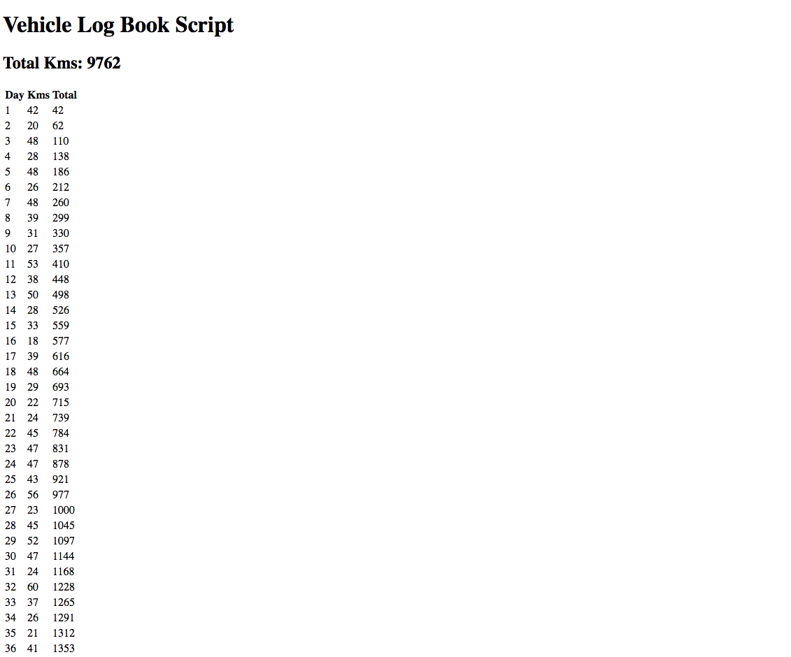

# Vehicle Logbook Generator

This is a script to generate vehicle log book values.

By entering the desired number of days, as well as minimum and maximum trip meter values per day.

It will then generate random trip meter values for each day, and tally the total.

